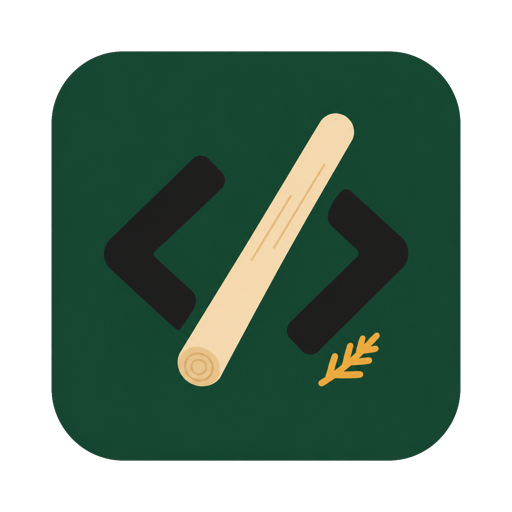

# 편백나무 몽둥이 · Pbeonbat Mongdungi

<p align="center">
  
</p>

[한국어](#한국어) | [English](#english)

LLM 코딩 실수를 줄이기 위한 OpenCode 스킬입니다. Andrej Karpathy의 코딩 원칙을
자기 점검 체크리스트로 적용하고, 로컬 Claude Code CLI와 Codex CLI를 읽기 전용
검증 파트너로 활용합니다.

An OpenCode skill for reducing common LLM coding mistakes. It applies Andrej
Karpathy's coding principles as a self-review checklist and uses local Claude
Code and Codex CLIs as read-only verification partners.

---

## 한국어

### 무엇을 해결하나요?

LLM 코딩 에이전트는 자주 다음과 같은 실수를 합니다.

- 코딩 전에 가정과 요구사항을 충분히 확인하지 않습니다.
- 요청하지 않은 추상화나 기능을 추가합니다.
- 관련 없는 인접 코드까지 정리해 diff를 키웁니다.
- 검증 가능한 완료 기준 없이 작업을 계속 다듬습니다.

편백나무 몽둥이는 네 가지 원칙으로 이 문제를 제어합니다.

1. **Think Before Coding**: 가정을 드러내고, 모호함을 먼저 해결합니다.
2. **Simplicity First**: 요청을 충족하는 최소한의 코드만 작성합니다.
3. **Surgical Changes**: 요청과 직접 관련된 부분만 변경합니다.
4. **Goal-Driven Execution**: 테스트나 명시적인 체크로 완료 조건을 검증합니다.

### 주요 기능

- 코딩 전후에 적용하는 자기 점검 워크플로우
- 과잉 구현과 불필요한 리팩터링 방지 규칙
- Claude Code CLI를 활용한 설계 검토와 diff 리뷰
- Codex CLI를 활용한 빠른 구현 검증과 두 번째 의견
- 설치된 CLI 경로와 버전을 자동으로 찾는 탐지 스크립트
- CLI를 파일 변경 권한 없이 실행하는 안전 가이드

### 설치

OpenCode 스킬 디렉터리에 저장소를 복제합니다.

```bash
mkdir -p ~/.config/opencode/skills
git clone <repository-url> \
  ~/.config/opencode/skills/pbeonbat-mongdungi
```

이미 설치한 경우 다음 명령으로 업데이트할 수 있습니다.

```bash
git -C ~/.config/opencode/skills/pbeonbat-mongdungi pull
```

### CLI 탐지 확인

Claude Code CLI와 Codex CLI는 선택 사항입니다. 설치되어 있지 않아도 핵심 규율과
워크플로우는 사용할 수 있습니다.

```bash
bash ~/.config/opencode/skills/pbeonbat-mongdungi/scripts/detect_cli.sh
```

스크립트 출력 모드는 다음과 같습니다.

```bash
bash scripts/detect_cli.sh --eval
bash scripts/detect_cli.sh --json
bash scripts/detect_cli.sh --check-only
```

### 언제 사용하나요?

- 기능 구현이나 버그 수정을 시작하기 전
- 리팩터링 범위가 불필요하게 커지는지 점검할 때
- 접근 방식이 둘 이상이라 두 번째 의견이 필요할 때
- 구현 후 diff의 단순성과 변경 범위를 리뷰할 때
- "이 코드가 정말 요청한 것만 해결했는가?"를 확인할 때

스킬의 전체 지침은 [`SKILL.md`](SKILL.md), CLI 호출 예시는
[`references/cli_usage.md`](references/cli_usage.md)에서 확인할 수 있습니다.

### 안전 원칙

- 외부 CLI는 기본적으로 읽기 전용 모드로 호출합니다.
- CLI의 답변을 그대로 적용하지 않고 직접 검토합니다.
- CLI를 찾지 못하거나 호출이 실패하면 그 사실을 명시합니다.
- 사용자 요청과 직접 관계없는 코드는 변경하지 않습니다.

### 프로젝트 구조

```text
.
├── assets
│   └── icon.png
├── SKILL.md
├── references
│   ├── cli_usage.md
│   └── karpathy_original.md
└── scripts
    └── detect_cli.sh
```

---

## English

### What does it solve?

LLM coding agents often make the same mistakes:

- They start coding before making assumptions and requirements explicit.
- They add abstractions or features that were never requested.
- They clean up unrelated neighboring code and inflate the diff.
- They keep polishing without a verifiable definition of done.

Pbeonbat Mongdungi addresses these problems with four principles:

1. **Think Before Coding**: State assumptions and resolve ambiguity first.
2. **Simplicity First**: Write the minimum code required by the request.
3. **Surgical Changes**: Change only what is directly relevant.
4. **Goal-Driven Execution**: Verify completion with tests or explicit checks.

### Features

- A self-review workflow for before, during, and after implementation
- Rules that discourage overengineering and unrelated refactoring
- Design and diff reviews through the local Claude Code CLI
- Fast second opinions and implementation checks through the Codex CLI
- Automatic detection of installed CLI paths and versions
- Guidance for invoking external CLIs without write access

### Installation

Clone the repository into your OpenCode skills directory:

```bash
mkdir -p ~/.config/opencode/skills
git clone <repository-url> \
  ~/.config/opencode/skills/pbeonbat-mongdungi
```

To update an existing installation:

```bash
git -C ~/.config/opencode/skills/pbeonbat-mongdungi pull
```

### Verify CLI detection

Claude Code and Codex CLIs are optional. The core discipline and workflow still
work when neither CLI is installed.

```bash
bash ~/.config/opencode/skills/pbeonbat-mongdungi/scripts/detect_cli.sh
```

Available output modes:

```bash
bash scripts/detect_cli.sh --eval
bash scripts/detect_cli.sh --json
bash scripts/detect_cli.sh --check-only
```

### When should it be used?

- Before implementing a feature or fixing a bug
- When checking whether a refactor has grown beyond its intended scope
- When choosing between multiple approaches
- When reviewing a completed diff for simplicity and scope
- When asking, "Did this code solve only what was requested?"

See [`SKILL.md`](SKILL.md) for the full instructions and
[`references/cli_usage.md`](references/cli_usage.md) for CLI recipes.

### Safety principles

- External CLIs run in read-only mode by default.
- CLI suggestions are reviewed instead of applied blindly.
- Missing or failed CLI invocations are reported explicitly.
- Unrelated code is left untouched.

### Project structure

```text
.
├── assets
│   └── icon.png
├── SKILL.md
├── references
│   ├── cli_usage.md
│   └── karpathy_original.md
└── scripts
    └── detect_cli.sh
```

## Acknowledgements

The four core principles are based on Andrej Karpathy's guidance for reducing
common mistakes made by AI coding agents. The preserved reference text is
available in [`references/karpathy_original.md`](references/karpathy_original.md).
